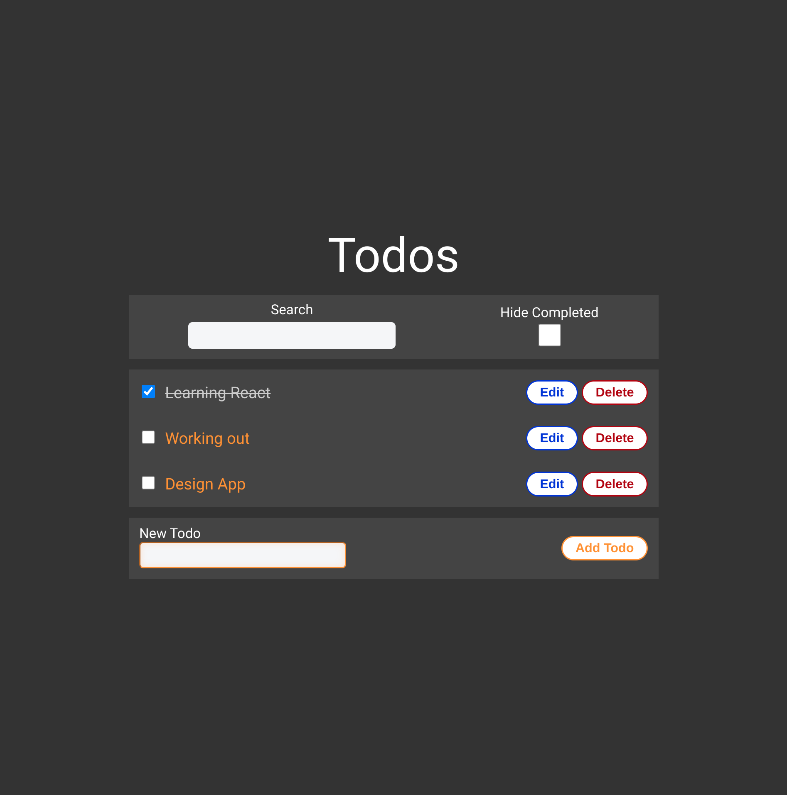
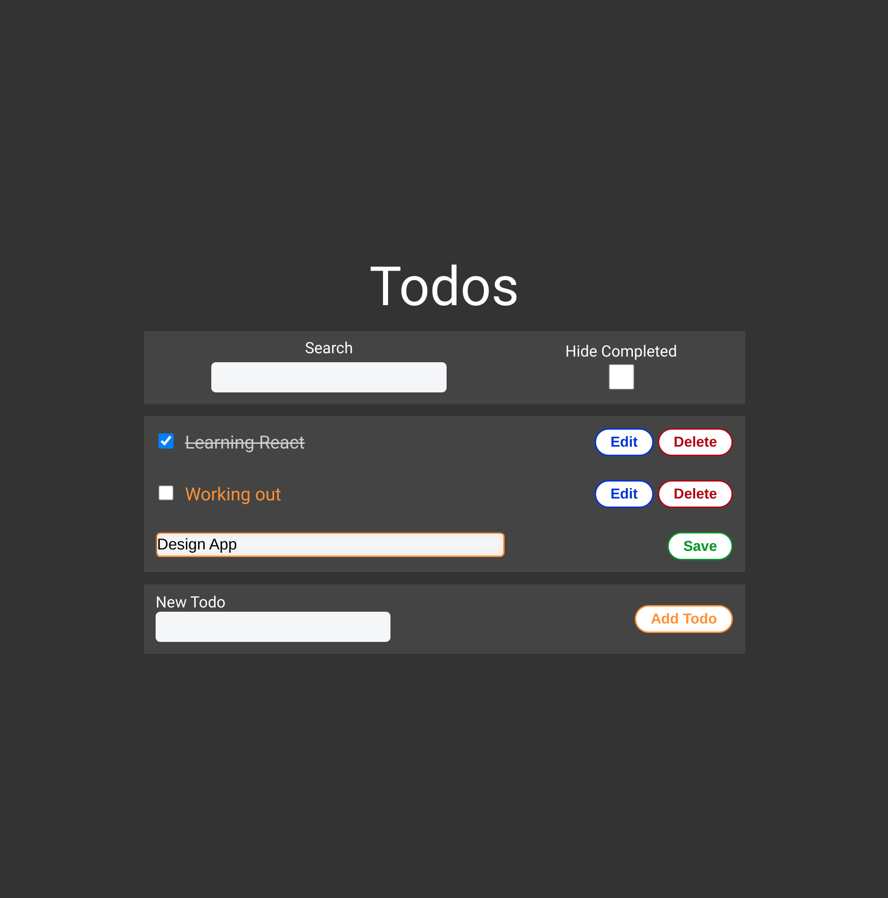

# Todo List

A simple todo list app built using React.js that can be used for adding, updating, deleting and filtering todos. Local storage is used to retain the data between sessions.

The purpose of the project is to solidify the concepts of several hooks and put them in practice: 
useContext, useEffect, useReducer, useState.

# Test it here
https://andreid.me/pages/mini-projects/todo-list.html

# Preview

