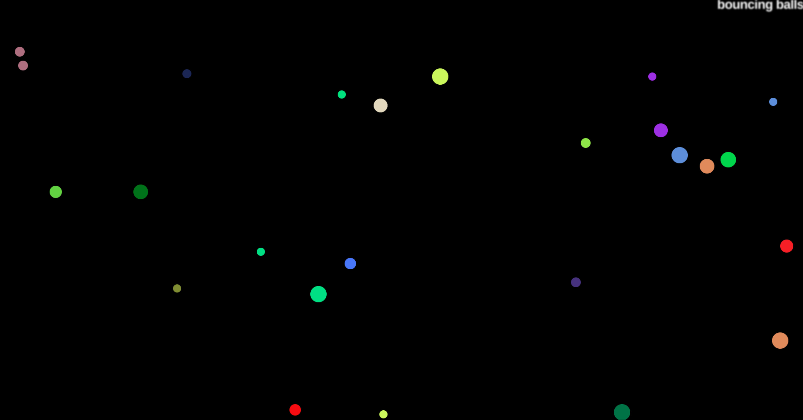
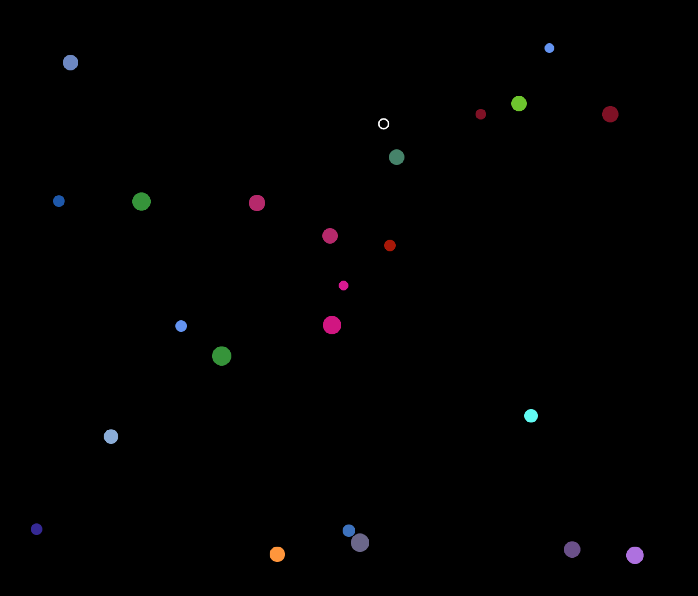

# Bouncing balls

The object building practice exercise offered by MDN, link below.   
https://developer.mozilla.org/en-US/docs/Learn/JavaScript/Objects/Object_building_practice

# Part 1
Initially just spawning the bouncing balls.

# Part 2
Creating an Evil Ball that can eat the others.
